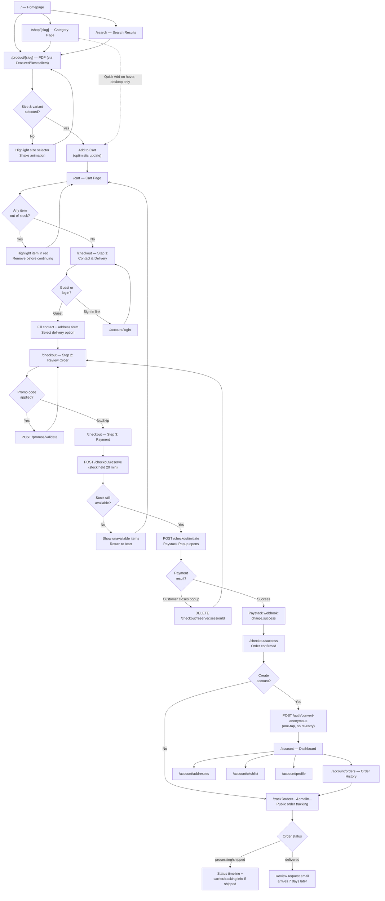
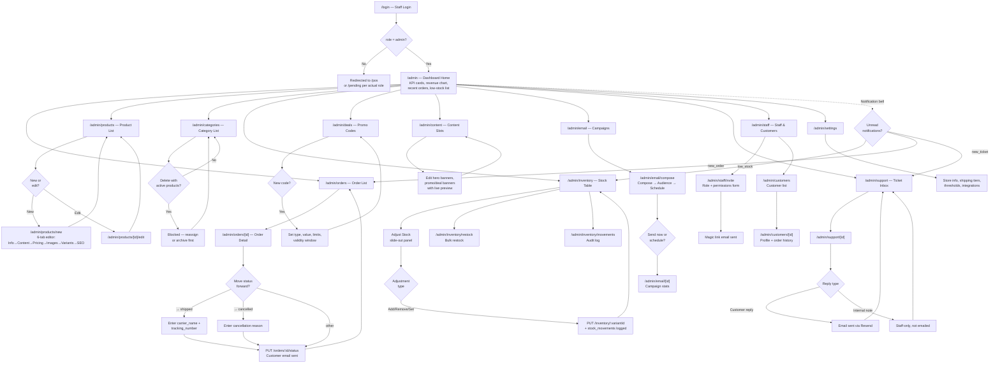

# GTS Platform — Process Flowcharts

**Version:** 1.0  
**Date:** June 2026  
**Audience:** Frontend engineers, coding agents, project planning  
**Purpose:** Screen-to-screen navigation flows for the three primary user journeys, so engineers can build one screen at a time without losing the bigger picture. These flows are derived directly from the routes and decision logic defined in `gts_02_storefront_spec.md`, `gts_03_cashier_spec.md`, `gts_05_admin_dashboard_spec.md`, and `gts_01_backend_spec.md`.

> **How to read these:** Each diagram uses Mermaid flowchart syntax. Rectangles are screens/pages. Diamonds are decisions (usually a validation check or a stock/payment result). Arrows show what happens next. Route paths in backticks match the exact URLs defined in the relevant spec — use them as the source of truth for routing logic.

---

## 1. Online Store — Customer Purchase Journey

Covers: browsing, cart, checkout, payment, and post-purchase. Source: `gts_02_storefront_spec.md`.



**Key decision points explained:**

| Decision | Logic | Spec reference |
|---|---|---|
| Size & variant selected? | Add to Cart button is disabled/shakes until a valid variant is chosen | Storefront §2.4 |
| Any item out of stock? | `POST /cart/:sessionId/validate` checked before allowing checkout | Storefront §2.6 |
| Stock still available? | Reservation attempt fails if another customer bought the last unit first | Backend §3.11, §4.5 |
| Payment result | Paystack Popup SDK `success` vs `close` callback | Storefront §2.7 |
| Create account? | Optional one-tap conversion using the email already provided at checkout | Storefront §2.8 |

---

## 2. Cashier Walk-In — POS Sale Journey

Covers: login, product search, cart build, payment, receipt. Source: `gts_03_cashier_spec.md`.

```mermaid
flowchart TD
    A["/login — Staff Login"] --> B{Role check:\ncan_process_pos?}
    B -- No --> B1["/pending — Access pending screen"]
    B -- Yes --> C["/pos — POS Home\n(search left, cart right)"]

    C --> D["Type in search bar\nor scan barcode/SKU"]
    D --> E{Exact SKU\nmatch?}
    E -- Yes --> F[Variant pre-identified]
    E -- No --> G["GET /pos/products/search\nResults grid shown"]
    G --> H["Tap product card"]

    F --> I{Single variant\nproduct?}
    H --> I
    I -- Yes --> J["Add 1 unit directly\nto cart"]
    I -- No --> K["Variant Selector Modal\nSize + Color + Qty"]
    K --> L{Variant\nin stock?}
    L -- No --> K
    L -- Yes --> J

    J --> M["Cart panel updates\n(right side, live)"]
    M --> D
    M --> N{Apply promo\nor manual discount?}
    N -- Promo --> N1["POST /promos/validate"]
    N1 --> M
    N -- Manual discount --> N2["Requires admin-granted\noverride permission\n+ activity_logs entry"]
    N2 --> M
    N -- Skip --> O["Select Payment Method\nCash or POS Terminal"]

    O --> P["Tap Confirm Payment"]
    P --> Q["Confirmation Modal\n(+ optional customer email)"]
    Q --> R["POST /pos/orders"]

    R --> S{Stock still\nsufficient?\n(SELECT FOR UPDATE)}
    S -- No --> S1[Error: item no longer\nhas sufficient stock]
    S1 --> M
    S -- Yes --> T["Order created\nchannel: walk_in"]

    T --> U["Success Screen\nOrder # + Total"]
    U --> V{Print or\nnew sale?}
    V -- "Print Receipt" --> V1["Browser print dialog\n@media print layout"]
    V1 --> U
    V -- "New Transaction" --> C

    C --> W["/pos/orders/today\n(view/void same-day orders)"]
    W --> X{Void an\norder?}
    X -- Yes --> X1["PUT /pos/orders/:id/void\n+ reason required\n+ inventory restored"]
    X1 --> W
```

**Key decision points explained:**

| Decision | Logic | Spec reference |
|---|---|---|
| can_process_pos? | Checked in dashboard middleware on every login | Cashier §1, Backend §3.2 |
| Exact SKU match? | Barcode scanners type + Enter; if it matches a variant SKU exactly, skip straight to the modal pre-filled | Cashier §7 |
| Single variant product? | Products with only one size/no color skip the modal entirely | Cashier §3.3 |
| Stock still sufficient? | Re-validated server-side with a row lock at order creation — not just at add-to-cart | Cashier §9, Backend §4.8 |
| Manual discount | Requires an admin-granted override and is always logged to `activity_logs` | Cashier §4.2 |

---

## 3. Admin — Daily Operations Journey

The admin portal is hub-and-spoke, not linear — admin lands on the dashboard and branches into whichever module needs attention. This flowchart shows the dashboard as the hub and the most common task inside each spoke. Source: `gts_05_admin_dashboard_spec.md`.



**Key decision points explained:**

| Decision | Logic | Spec reference |
|---|---|---|
| role = admin? | Middleware checks JWT `app_metadata.role`; anything else is redirected away from `/admin/*` entirely | Admin §1.1 |
| → shipped requires carrier info | `carrier_name` + `tracking_number` captured in the same status-change action; triggers the `OrderShipped` email | Admin §3.2, Backend §4.7 |
| Delete category with active products | Blocked at the database/API layer, not just the UI | Admin §5 |
| Notification bell routing | Each notification type deep-links to the relevant list, pre-filtered where possible | Admin §1.2, Backend §4.16 |

---

## 4. How These Flows Relate to the Sprint Plan

Use these flowcharts to scope individual sprint tickets without re-deriving navigation logic each time:

- **Sprint 2–3** (Product Catalog, Cart/Checkout) build the entire top half of Flowchart 1, ending at `/checkout/success`.
- **Sprint 4** (POS) builds Flowchart 2 in full.
- **Sprint 6** (Order Management & Admin Core) builds the `/admin/orders` branch of Flowchart 3, including the shipped/tracking flow.
- **Sprint 7** (Admin Full Feature Set) builds the remaining spokes: products, categories, deals, content, email, support.
- **Sprint 8** (Reviews/Wishlist/Account) completes the bottom half of Flowchart 1 (`/account/*` branch).

Each screen named in these diagrams has a corresponding, more detailed specification in its respective document — this file is the map; the portal specs are the terrain.
